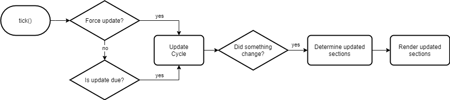
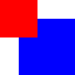
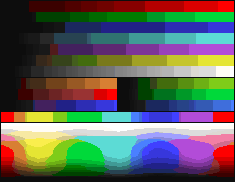

frames
======

Abstract component-based 2D rendering engine.

[[_TOC_]]

## How it works

### Update and Render Cycle



The `tick()` method can be called as often (or as little) as one likes. An update will be executed if it has either been forced or if enough time has
passed since the last update (`delta >= updateInterval`). If the delta time is bigger or equal to a multiple of `updateInterval`, multiple update
cycles will be triggered to try to catch up.

On a successful update (i.e. it returns `true`), the render cycle will be started. When rendering, the frame determines which parts (i.e. sections) of
the viewport should be (re-)rendered. If the frame renders anything at all, the updated sections can be retrieved using `hasUpdatedSections()` and
`pullUpdatedSections()`. After retrieving the updated sections, they will be cleared. If you do not use them (i.e. when always using the full
viewport), `clearUpdatedSections()` should be called to reset the state of `hasUpdatedSections()`.

## Components

Components are the building blocks of every frame. Every component has a position and dimensions which define its bounds. It can manually be marked
as `dirty` or does so automatically, whenever its bounds change in any way. A component marked as dirty will be re-rendered in the next render cycle.
Every other component intersecting with the bounds of a dirty component will be (fully or partially) re-rendered as well.

```kotlin
val component = Component(Point(5, 5), Dimension(32, 32))

// Change the components position and size.
// Changes to the bounds will automatically make this component dirty.
component.position.move(5, 10)
component.dimensions.setSize(64, 64)

// Manually mark this component as dirty.
component.dirty = true
```

### Dummy Component

If there ever is a need for a component not doing anything, use this one. This component will not render anything. However, when marking it as dirty
or changing the position or dimensions, a partial re-render for all components overlapping with this one will still be triggered.

### Color Component

Arguably one of the simplest components there are. This component simply renders a solid color within its bounds.

```kotlin
val component = ColorComponent(Point(0, 0), Dimension(32, 32), Color.BLUE)

// Change the color.
component.color = Color.RED
```

### Image Component

This component will render any `BufferedImage` which has at least the dimensions of the component itself.

```kotlin
val image = imageAdapter.get("some_image")
val component = ImageComponent(Point(), Dimension(64, 64), image);

// Change the image.
component.image = imageAdapter.get("another_image")

// Check if there is at least one colored pixel within the given section.
val intersects = component.intersectsPixels(Rectangle(32, 0, 1, 64))
```

### Compound Component

To combine multiple components, use a `CompoundComponent`. The positions of child components are relative to their parent.

```kotlin
val compound = CompoundComponent(Point(0, 0), Dimension(32, 32))
compound.addComponent(ColorComponent(Point(8, 8), Dimension(24, 24), Color.BLUE))
compound.addComponent(ColorComponent(Point(0, 0), Dimension(16, 16), Color.RED))
```



## Color Transformers

Use color transformers to convert the rendered color values. This can be useful if a custom use case requires a very specific color spectrum or when
effects should be applied to the rendered image.

Because color transformers can be quite slow, they will be applied to the updated sections only. Additionally, caching may be used (e.g. in
`PaletteColorTransformers`) to prevent re-calculating the same values potentially thousands of times.

| Transformer | Original | Result |
| ----------- | -------- | ------ |
| `DefaultColorTransformer` |  |  |
| `MinecraftColorTransformer` |  |  |
